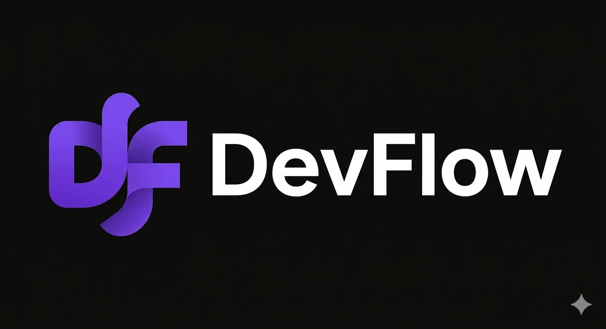
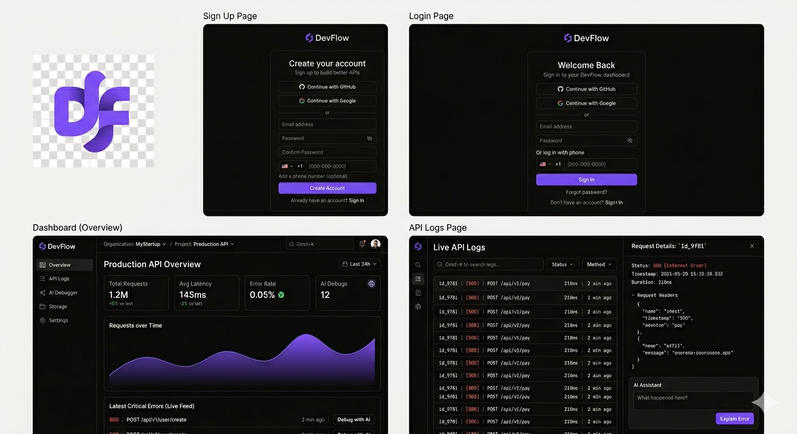
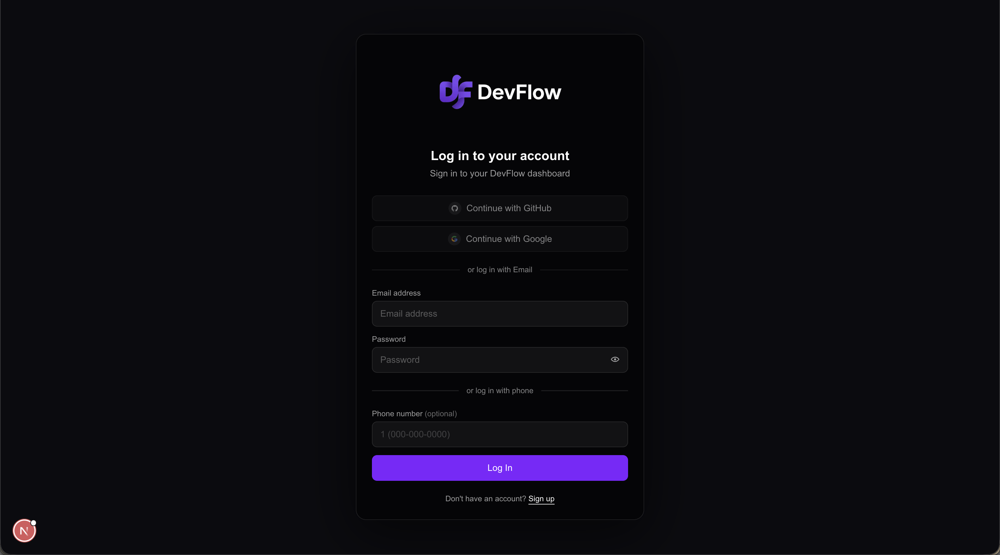
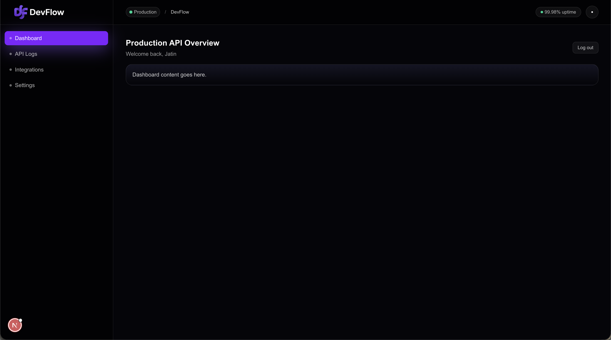
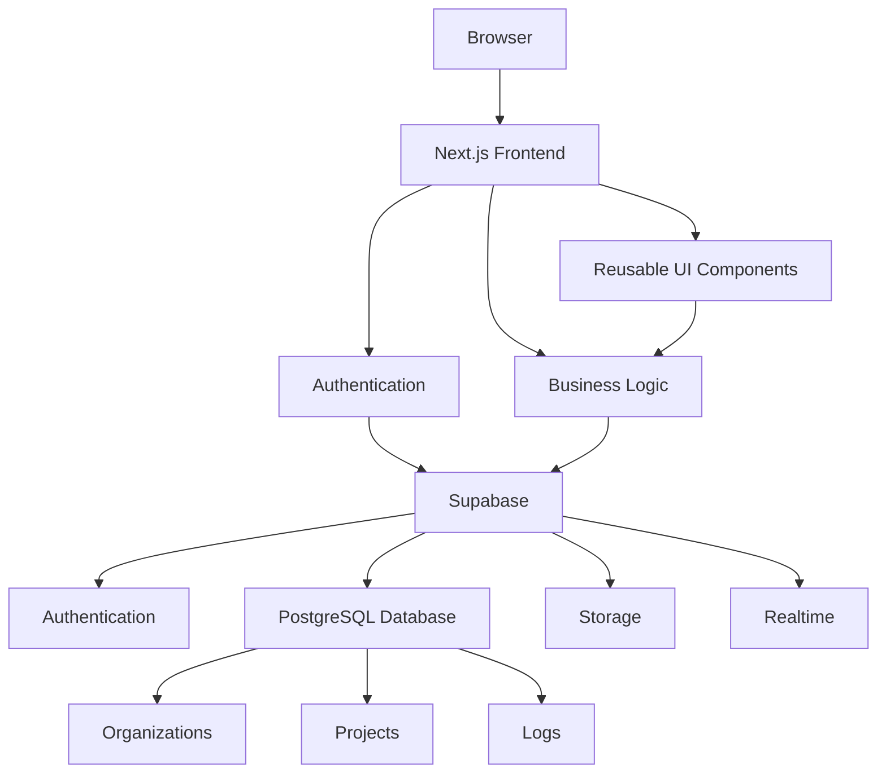
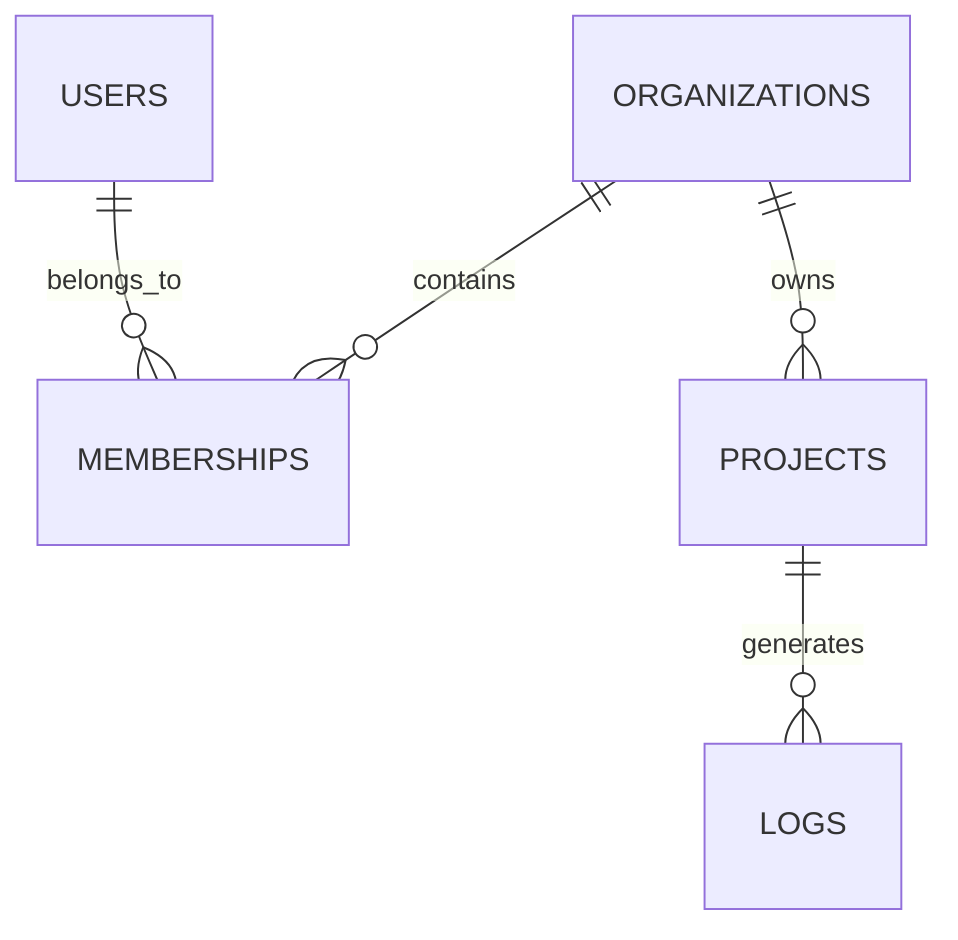
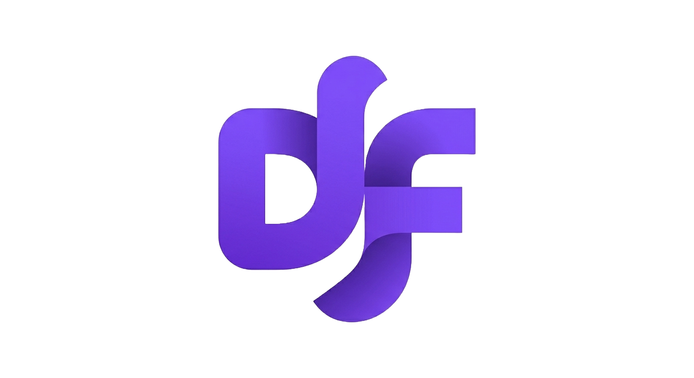

<div align="center">



<br/>

# 🚀 DevFlow

### Multi-Tenant Developer Workflow & API Observability Platform

*A production-grade SaaS application focused on API observability, developer workflows, multi-tenant architecture, authentication, and AI-powered debugging.*

<br/>


<br/>

[](#)
[](#)
[](#)

</div>

---

> ⚠️ **This project is currently under active development.**
>
> New features, screenshots, documentation and architecture diagrams are continuously being added.

---

# 📸 Project Preview

<p align="center">



</p>

---

# 📖 About DevFlow

**DevFlow** is a production-inspired **Developer Workflow & API Observability Platform** built using **Next.js**, **TypeScript**, and **Supabase**.

Rather than creating another CRUD application, DevFlow focuses on solving real engineering problems that modern SaaS companies face.

The project demonstrates production-grade software engineering concepts including:

- 🏢 Multi-Tenant SaaS Architecture
- 🔐 Authentication & Authorization
- 👥 Role-Based Access Control (RBAC)
- 📂 Organization & Project Management
- 📊 API Observability
- 📈 Performance Monitoring
- ⚡ Realtime Updates
- 🤖 AI-assisted Debugging
- 🏗️ Scalable Frontend Architecture

The overall goal is to build a project that reflects the engineering standards of companies like:

- Stripe
- Vercel
- Supabase
- Datadog
- Sentry
- GitHub
- Notion

instead of another portfolio CRUD application.

---

# ✨ Core Features

## 🔐 Authentication

- Email Authentication
- Secure Login
- User Registration
- Protected Routes
- Session Persistence
- JWT Authentication (via Supabase Auth)

---

## 🏢 Multi-Tenant SaaS

- Organizations
- Team Members
- User Roles
- Tenant Isolation
- Organization Switching

---

## 📂 Project Management

- Create Projects
- Manage Projects
- Organization-specific Projects
- Project Dashboard

---

## 📊 API Observability

- Live API Logs
- Request Monitoring
- Error Tracking
- Response Time Monitoring
- Performance Metrics

---

## 🤖 AI Assistant (Planned)

- AI Error Explanation
- Root Cause Analysis
- AI Debug Suggestions
- Error Summarization

---

# 📷 Authentication

<p align="center">



</p>

The authentication system is powered by **Supabase Auth**, providing:

- Secure Email Authentication
- Session Management
- Protected Routes
- JWT Tokens
- Persistent Login
- Future OAuth Support (GitHub & Google)

---
# 📊 Dashboard

<p align="center">



</p>

The DevFlow dashboard provides a centralized view of your application's health, API activity, and project metrics.

Current dashboard modules include:

- 📈 API Overview
- 📊 Performance Metrics
- 📂 Organization & Project Context
- ⚡ Quick Navigation
- 🔐 Secure User Session
- 🎯 Modern SaaS Interface

More analytics widgets, charts, and realtime monitoring will be added as the project evolves.

---

# 🏗️ System Architecture



---

# 🧠 Multi-Tenant Data Model



### Data Relationships

A **User** can belong to multiple organizations.

An **Organization** can contain multiple users through memberships.

Each **Organization** owns multiple projects.

Each **Project** generates API logs and metrics.

This architecture enables:

- Multi-tenancy
- Tenant Isolation
- RBAC
- Scalable SaaS Design

---

# 🛠️ Tech Stack

| Category | Technology |
|-----------|------------|
| Framework | Next.js (App Router) |
| Language | TypeScript |
| Styling | Tailwind CSS |
| Backend | Supabase |
| Database | PostgreSQL |
| Authentication | Supabase Auth (JWT) |
| Realtime | Supabase Realtime |
| Storage | Supabase Storage |
| Deployment | Vercel |

---

## Frontend

- Next.js 15
- React
- TypeScript
- Tailwind CSS
- App Router

---

## Backend

- Supabase
- PostgreSQL
- Row Level Security (Planned)
- Edge Functions (Planned)

---

## Authentication

- Email Authentication
- JWT
- Session Management
- Protected Routes

---

## Database

- PostgreSQL

Current Tables:

- Organizations
- Memberships
- Projects
- Logs

Future Tables:

- Integrations
- Notifications
- API Keys
- Audit Logs

---

## AI (Planned)

- OpenAI Integration
- AI Debug Assistant
- Error Explanation
- Root Cause Analysis

---

# 📂 Project Structure

```text
devflow/

├── app/
│   ├── (auth)/
│   │   ├── login/
│   │   └── signup/
│   │
│   ├── dashboard/
│   │   ├── projects/
│   │   ├── logs/
│   │   └── page.tsx
│   │
│   ├── layout.tsx
│   └── page.tsx
│
├── components/
│   ├── auth/
│   ├── dashboard/
│   └── ui/
│
├── hooks/
│
├── lib/
│   ├── auth.ts
│   ├── supabase.ts
│   └── api.ts
│
├── docs/
│   ├── overview.png
│   ├── login.png
│   └── dashboard.png
│
├── public/
│   ├── logo.png
│   ├── logo_text.png
│   └── favicon.ico
│
└── README.md
```

---

# 🎯 Engineering Principles

This project follows several software engineering principles:

- Separation of Concerns
- Reusable Components
- Modular Architecture
- Clean Folder Structure
- Type Safety
- Production-ready Code Organization
- Scalable Database Design
- Multi-Tenant SaaS Architecture
- Developer Experience First
# 🚀 Getting Started

## Prerequisites

Before running the project locally, ensure you have:

- Node.js 20+
- npm / pnpm / yarn
- A Supabase project
- Git

---

## Clone Repository

```bash
git clone https://github.com/raghav1924/devFlow.git

cd devFlow
```

---

## Install Dependencies

```bash
npm install
```

or

```bash
pnpm install
```

---

## Configure Environment Variables

Create a `.env.local` file in the root directory.

```env
NEXT_PUBLIC_SUPABASE_URL=YOUR_SUPABASE_URL

NEXT_PUBLIC_SUPABASE_ANON_KEY=YOUR_SUPABASE_ANON_KEY
```

---

## Start Development Server

```bash
npm run dev
```

Visit:

```
http://localhost:3000
```

---

# 📅 Development Roadmap

## ✅ Phase 1 — Foundation

- [x] Next.js Setup
- [x] TypeScript Configuration
- [x] Tailwind CSS
- [x] Supabase Integration
- [x] Authentication
- [x] Protected Routes
- [x] Dashboard Layout
- [x] Branding & Logo

---

## 🚧 Phase 2 — Multi-Tenant SaaS

- [ ] Organizations
- [ ] Memberships
- [ ] Projects
- [ ] RBAC
- [ ] Tenant Isolation
- [ ] Row Level Security

---

## 🚧 Phase 3 — API Observability

- [ ] Live API Logs
- [ ] Error Monitoring
- [ ] Performance Metrics
- [ ] Latency Dashboard
- [ ] Log Filtering

---

## 🚧 Phase 4 — Storage & Realtime

- [ ] File Uploads
- [ ] Supabase Storage
- [ ] Realtime Updates
- [ ] Live Notifications

---

## 🚧 Phase 5 — AI Features

- [ ] AI Debug Assistant
- [ ] Root Cause Analysis
- [ ] Error Explanation
- [ ] AI Suggestions
- [ ] Smart Insights

---

# 📸 Screenshots

## Login

<p align="center">


</p>

---

## Dashboard

<p align="center">


</p>

---

## Complete Product Vision

<p align="center">


</p>

---

# 🎯 Current Status

> 🚧 **DevFlow is actively being developed.**

Upcoming milestones include:

- Organization Management
- Project Dashboard
- Live API Monitoring
- AI Debugging Assistant
- Realtime Event Streaming
- Public SDK
- CLI Tool

---

# 🤝 Contributing

Contributions are always welcome!

If you'd like to improve DevFlow:

1. Fork the repository
2. Create your feature branch

```bash
git checkout -b feature/amazing-feature
```

3. Commit your changes

```bash
git commit -m "Add amazing feature"
```

4. Push to your branch

```bash
git push origin feature/amazing-feature
```

5. Open a Pull Request

---

# ⭐ Future Improvements

- API SDK
- Public REST API
- Webhooks
- CLI
- Billing & Subscription
- Team Invitations
- Audit Logs
- Usage Analytics
- Dark/Light Theme
- Mobile Responsive Dashboard
- End-to-End Testing
- Docker Deployment
- Kubernetes Support

---

# 📄 License

This project is licensed under the **MIT License**.

Feel free to use, modify and distribute it.

---

# 🙌 Acknowledgements

Built using amazing technologies:

- Next.js
- React
- TypeScript
- Tailwind CSS
- Supabase
- PostgreSQL
- Vercel

---

<div align="center">



# DevFlow

### Multi-Tenant Developer Workflow & API Observability Platform

Built with ❤️ using **Next.js**, **TypeScript**, **Supabase**, and **PostgreSQL**

<br/>

⭐ If you found this project interesting, consider giving it a **Star** on GitHub!

<br/>

*"Build products. Learn deeply. Ship continuously."* 🚀

</div>